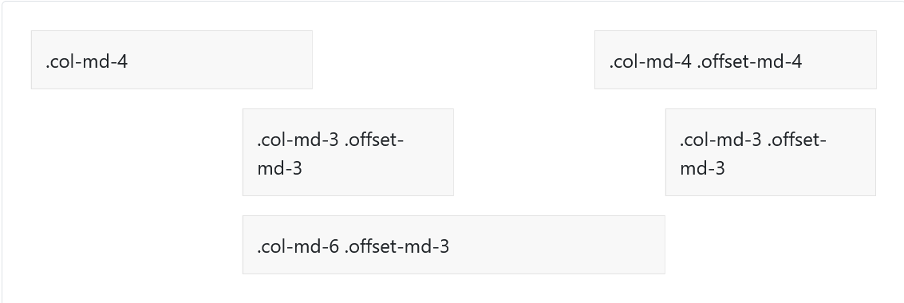

# Exemples i proves en Html, css i javascript
## pissarra pixelada
`professions.html` genera una graella per escriure amb quadradets.

## Layout a bootstrap
[Documentació bootstrap en espanyol](https://getbootstrap.esdocu.com/docs/5.1/)

### Contenidors
Els contenidors centren i contenen la resta d'elements. Depèn del viewport, tenen el 100% de l'amplada o un `max-width` que va determinat per una sèrie de breakpoints responsive. En concret són sis breakpoints. Els breakpoints es basen en media-queries `min-width` que depenen de l'amplada del dispositiu. Per exemple: 
* el `container-md` deixarà marge i es centrarà en un dispositiu mitjà (mitjà tenint en compte el que bootstrap considera mitjà i el valor que li dona als breakpoints) o més gran que mitjà. En canvi, per els dispositius més petits, ocuparà el 100%.
* `container-fluid` ocuparà sempre el 100% independentment del dispositiu.
* `container` deixarà marge i es centrarà independentment del dispositiu a excepció de que sigui un dispositiu extra small. És igual que un `container-sm`.

> Los contenedores centran y rellenan horizontalmente su contenido. Usa .container para un ancho de píxel responsive, .container-fluid para width: 100% en todos los viewports y dispositivos, o un contenedor responsive (p. ej., .container-md) para una combinación entre fluido y anchos en píxeles. 

### Grid
Es composa de:
* Containers
* Fil·les (*row*) que fan d'envoltori de columnes
* Columnes (*col*). L'ampla d'un container es composa de 12 columnes. Les classes columne, `col-x` abarquen l'ample de la columna. Per exemple, `col-4` ocupa 4 columnes de les 12 que té el container.


* Si vols que totes les columnes tinguin el mateix ample, fes servir `class='col'`.
* Si fiques ample en una columna i només `col` en la resta, la resta es distribueix equitativament l'espai sobrant.
* Si el contingut de la columna pot ser variable i volem que l'ample vagi en funció del contingut, fer servir class `col-{breakpoint}-auto`
* Combina classes de diferents breakpoints si vols que la disposició canviï depenent del tipus de dispositiu:

```html
<div class="container">
  <!-- Apila las columnas en dispositivos móviles haciendo una de ancho completo y la otra de ancho medio -->
  <div class="row">
    <div class="col-md-8">.col-md-8</div>
    <div class="col-6 col-md-4">.col-6 .col-md-4</div>
  </div>

  <!-- Las columnas comienzan con un 50% de ancho en dispositivos móviles y cambian hasta un 33,3% de ancho en computadoras de escritorio -->
  <div class="row">
    <div class="col-6 col-md-4">.col-6 .col-md-4</div>
    <div class="col-6 col-md-4">.col-6 .col-md-4</div>
    <div class="col-6 col-md-4">.col-6 .col-md-4</div>
  </div>

  <!-- Las columnas siempre tienen un 50% de ancho, en dispositivos móviles y de escritorio -->
  <div class="row">
    <div class="col-6">.col-6</div>
    <div class="col-6">.col-6</div>
  </div>
</div>
```
#### Columnes de filera
s'apliquen als envoltoris de les columnes (`class='row'`) per establir la quantitat de columnes del teu layout en funció del tipus de dispositiu:
* `row-cols-X`
* `row-cols-{breakpoint}-X`
* `row-cols-auto`: per donar a les columnes la seva amplada natural.

### Columnes
#### Alineament vertical
* `align-items-{start|center|end}`: Té a veure amb la propietat `align-items` de *flexbox* i s'aplica sobre l'envoltori de les columnes.
* `align-self-{start|center|end}`: Si volem modificar l'alineament en una sola columna.

#### Alineament horitzontal
* `justify-content-{start|center|end|around|between|evenly}`

#### Moure columnes
Hi han dos maneres:
* Amb classes responsive de quadrícula. `offset-{breakpoint}-*` sobre la columna que vols moure. Per exemple: 



```html
<div class="container">
  <div class="row">
    <div class="col-md-4">.col-md-4</div>
    <div class="col-md-4 offset-md-4">.col-md-4 .offset-md-4</div>
  </div>
  <div class="row">
    <div class="col-md-3 offset-md-3">.col-md-3 .offset-md-3</div>
    <div class="col-md-3 offset-md-3">.col-md-3 .offset-md-3</div>
  </div>
  <div class="row">
    <div class="col-md-6 offset-md-3">.col-md-6 .offset-md-3</div>
  </div>
</div>
```

* [Amb utilitats de marge entre columnes germanes](https://getbootstrap.esdocu.com/docs/5.1/layout/columns/#utilidades-de-margen).

### Gutters
Són el padding entre les columnes.